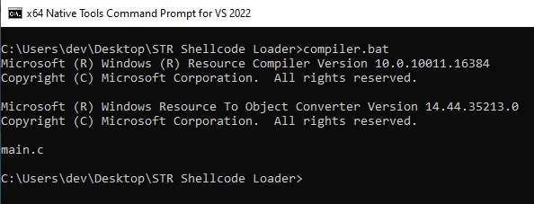
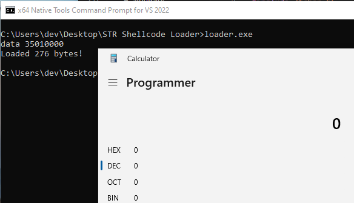
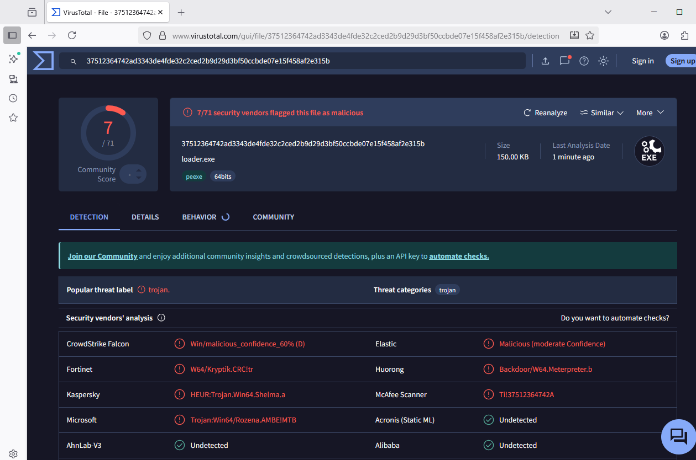

# STR Shellcode Loader
This is a minimal proof of concept that demonstrates loading a binary payload from the PE resource section using string resources (RT_STRING) instead of raw RCDATA. It is intended for controlled, defensive or research use only — do not use this to perform malicious activities.

Note: This PoC is not promoted as a reliable AV bypass. It demonstrates an alternative resource encoding (string table) for storing payload bytes; the goal is to explore how different encodings affect static detection, not to provide an operational evasion technique.

## Introduction
Traditionally, many PoCs for shellcode loaders store raw shellcode in the .rsrc section of a PE and then load it at runtime. A common pattern uses FindResource / LoadResource / LockResource and SizeofResource to retrieve the raw bytes.

While testing AV engines, I noticed that this pattern can itself trigger detections. To explore alternatives, I experimented with different resource types and discovered that string resources (RT_STRING) can be abused to store payload data retrievable via LoadStringA. Below is a short proof of concept I designed to store and retrieve a payload from the PE resource section.

## How to use it
1. Using the Python script, create an RT_STRING file for your shellcode, this will create the resources\strings.rc file and will be used by the compiler to save the resource
```cmd
python.exe encoder.py evil.bin
```

2. Edit the constant PAYLOAD_SIZE on main.c

3. Compile using ```compiler.bat```



4. Execute the ```loader.exe``` binary.



## Virus Total

Not an impressive result, but I suspect Microsoft Defender started flagging the technique after I pushed my notes to my private GitHub repository. — though maybe I’m just overthinking it.

